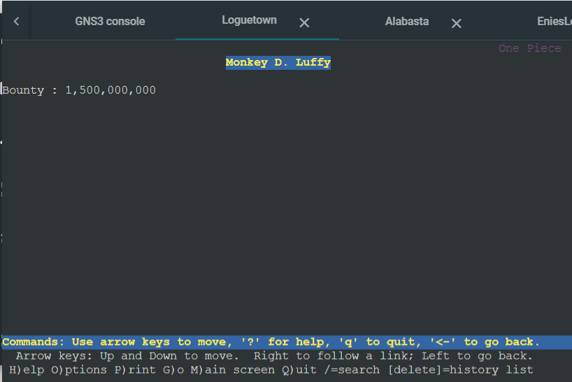
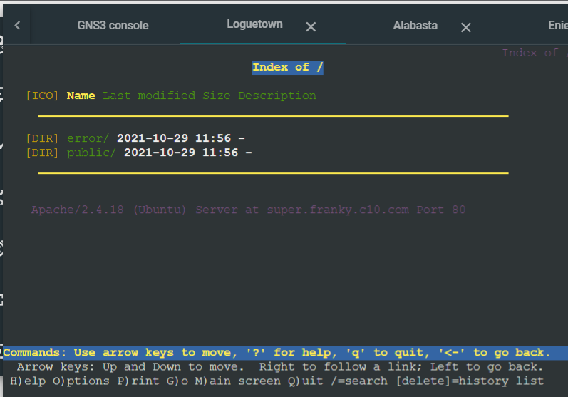
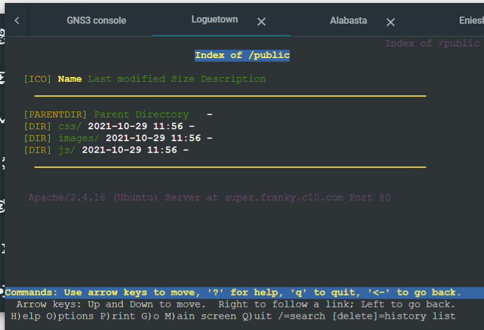
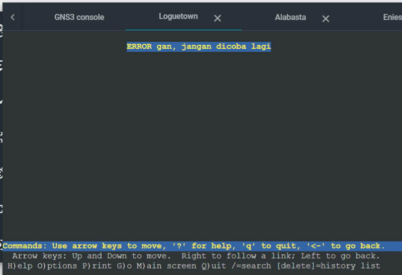
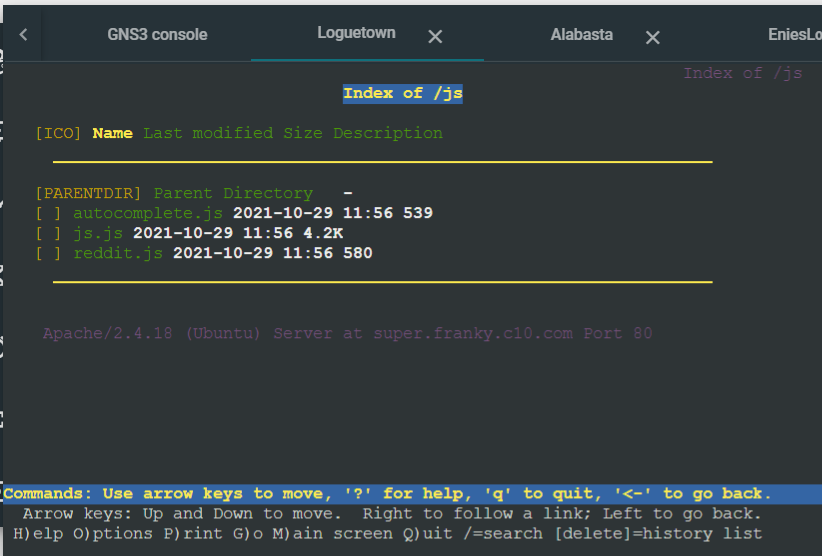

# Jarkom-Modul-2-C10-2021

## Anggota Kelompok C10
| Nama | NRP |
| ------------- | ------------- |
| Christian Bennett Robin | 05111940000078  |
| Erza Janitradevi Nadine  | 05111940000153  |
| Akmal Zaki Asmara  | 05111940000154  |

## Soal dan Pembahasan
### No 1
- Membuat topologi yang terdiri dari EniesLobby sebagai DNS Master, Water7 sebagai DNS Slave, Skypie sebagai webserver, dan Alabasta serta Loguetown sebagai client yang terhubung dengan Foosha. Berikut adalah gambar topologi yang telah dibuat : <br/>

- Masing-masing node dapat mengakses internet, hal ini ditunjukkan dengan melakukan ping ke google.com
     - Loguetown
      
     - Alabasta
      
     - EniesLobby
      
     - Water7
       
     - Skypie
      

### No 2
- **Soal** : Membuat website utama dengan mengakses franky.yyy.com dengan alias www.franky.yyy.com pada folder kaizoku 
- Menambahkan zone franky.c10.com pada file `/etc/bind/named.conf.local`
  ```
  zone "franky.c10.com" {
    type master;
    file "/etc/bind/kaizoku/franky.c10.com";
  };
  ```
- Membuat folder kaizoku pada `/etc/bind/` dengan command`mkdir /etc/bind/kaizoku`, kemudian membuat file config `franky.c10.com`
  
- Memodifikasi config pada file `/etc/bind/kaizoku/franky.c10.com`. Menggunakan NS untuk mendelegasikan zone yang telah dibuat pada franky.c10.com, kemudian domain dipetakan pada IP Enieslobby yaitu `10.19.2.2`. Untuk membuat alias www.franky.c10.com menggunakan CNAME. Berikut adalah modifikasi config yang telah dilakukan:


### No 3
- **Soal** : Membuat subdomain super.franky.yyy.com dengan alias www.super.franky.yyy.com yang diatur DNS nya di EniesLobby dan mengarah ke Skypie
- Memodifikasi config pada file `/etc/bind/kaizoku/franky.c10.com`. Menggunakan NS untuk mendelegasikan zone yang telah dibuat pada super.franky.c10.com, kemudian domain dipetakan pada IP Skypie yaitu `10.19.2.4`. Untuk membuat alias www.super.franky.c10.com menggunakan CNAME. Berikut adalah modifikasi config yang telah dilakukan:

- Test melakukan ping super.franky.c10.com dan www.super.franky.c10.com pada Loguetown. Dapat terlihat bahwa ip mengarah pada Skypie. <br/>


### No 4
- **Soal** : Membuat reverse domain untuk domain utama
- Menambahkan 2.19.10.in-addr.arpa pada file `/etc/bind/named.conf.local`
  ```
     zone "2.19.10.in-addr.arpa" {
         type master;
         file "/etc/bind/kaizoku/2.19.10.in-addr.arpa";
     };
  ```
- Membuat file config `2.19.10.in-addr.arpa`pada folder kaizoku
- Memodifikasi config pada file `/etc/bind/kaizoku/2.19.10.in-addr.arpa`. Menggunakan NS untuk mendelegasikan zone yang telah dibuat pada 2.19.10.in-addr.arpa dengan domain franky.c10.com. Menggunakan PTR untuk mereverse domain dengan 2 sebagai byte keempat dari IP Enieslobby. Berikut adalah modifikasi config yang telah dilakukan:

- Testing konfigurasi dengan `host -t PTR 10.19.2.2` pada Loguetown


### No 5
- **Soal** : Buat Water7 sebagai DNS Slave untuk domain utama
- Memodifikasi zone franky.c10.com pada /etc/named.conf.local Enieslobby dengan menambahkan notify kepada IP Water7 sebagai DNS slave.
```
     notify true	
     also-notify { 10.19.2.3; };
```
- Menambahkan zone franky.c10.com pada /etc/named.conf.local pada Water7 sebagai DNS Slave dari Enieslobby
```
     zone franky.c10.com {
         type slave;       
         masters { 10.19.2.2; }; // Ip Enieslobby sebagai DNS Master
         file "/var/lib/bind/franky.c10.com";
     }
```
- Testing ping franky.c10.com dengan mematikan service bind9 Enieslobby

- Loguetown sebagai client dapat melakukan ping ke franky.c10.com

 
### No 6
- **Soal** : Buat subdomain mecha.franky.yyy.com dengan alias www.mecha.franky.yyy.com yang didelegasikan dari EniesLobby ke Water7 dengan IP menuju ke Skypie dalam folder sunnygo
- Pada Enieslobby
     - Memodifikasi config pada file `/etc/bind/kaizoku/2.19.10.in-addr.arpa` dengan membuat subdomain mecha.franky.c10.com dan domain alias                                www.mecha.franky.c10.com. Kemudian subdomain dan aliasnya didelegasikan ke Water7 dengan `ns1` dengan mengarahkan ke IP Water7 yaitu `10.19.2.3`. Berikut            adalah modifikasi config yang telah dilakukan:
     
     - Edit file `/etc/bind/named.conf.options` dengan menambahkan `allow-query{any;};` dan comment `dnssec-validation auto;`<br/>
       
     - Menambahkan `allow-transfer { 10.19.2.3; }` pada file `/etc/bind/named.conf.local` sehingga zone franky.c10.com menjadi
          ```
          zone "franky.c10.com" {
              type master;
              notify yes;
              also-notify { 10.19.2.3; }; // Masukan IP Water7 tanpa tanda petik
              allow-transfer { 10.19.2.3; }; // Masukan IP Water7 tanpa tanda petik
              file "/etc/bind/kaizoku/franky.c10.com";
          };
          ```
 - Pada Water7
     - Edit file `/etc/bind/named.conf.options` dengan menambahkan `allow-query{any;};` dan comment `dnssec-validation auto;`<br/>
       
     - Menambahkan zone mecha.franky.c10.com pada `/etc/bind/named.conf.local` sebagai berikut
       ```
       zone "mecha.franky.c10.com" {
            type master;
            file "/etc/bind/sunnygo/mecha.franky.c10.com";
       };
       ```
     - Membuat folder sunnygo pada `/etc/bind/` dengan command`mkdir /etc/bind/sunnygo`, kemudian membuat file config `mecha.franky.c10.com`
       
     - Memodifikasi config pada file `/etc/bind/sunnygo/mecha.franky.c10.com`. Menggunakan NS untuk mendelegasikan zone yang telah dibuat pada mecha.franky.c10.com,        kemudian domain dipetakan pada IP Skypie yaitu `10.19.2.4`. Untuk membuat alias www.mecha.franky.c10.com menggunakan CNAME yang juga mengarah ke IP Skypie.          Berikut adalah modifikasi config yang telah dilakukan:
       
- Testing melakukan ping mecha.franky.c10.com dan www.mecha.franky.c10.com pada Alabasta. Dapat terlihat bahwa IP mengarah pada IP Skypie. <br/>
   
   

### No 7
- **Soal** : Buat subdomain melalui Water7 dengan nama general.mecha.franky.yyy.com dengan alias www.general.mecha.franky.yyy.com yang mengarah ke Skypie
- Memodifikasi config pada file `/etc/bind/sunnygo/mecha.franky.c10.com`. Membuat subdomain general.mecha.franky.c10.com dengan alias 
  www.general.mecha.franky.c10.com. IP subdomain ini juga mengarah ke IP Skypie. Berikut adalah modifikasi config yang telah dilakukan:
  
- Testing melakukan ping general.mecha.franky.c10.com dan www.general.mecha.franky.c10.com pada Alabasta. Dapat terlihat bahwa IP mengarah pada IP Skypie.
  
  

### No 8
Soal:
Setelah melakukan konfigurasi server, maka dilakukan konfigurasi Webserver. Pertama dengan webserver www.franky.yyy.com. Pertama, luffy membutuhkan webserver dengan DocumentRoot pada /var/www/franky.yyy.com.

Jawab:
Buat direktori baru yaitu /var/www/franky.c10.com dengan menggunakan `mkdir /var/www/franky.c10.com` 

Setelah itu, edit konfigurasi /etc/apache2/sites-available/franky.c10.com.conf agar filenya menjadi seperti ini

```console
<VirtualHost *:80>
        # The ServerName directive sets the request scheme, hostname and port that
        # the server uses to identify itself. This is used when creating
        # redirection URLs. In the context of virtual hosts, the ServerName
        # specifies what hostname must appear in the request's Host: header to
        # match this virtual host. For the default virtual host (this file) this
        # value is not decisive as it is used as a last resort host regardless.
        # However, you must set it for any further virtual host explicitly.

        ServerAdmin webmaster@localhost
        DocumentRoot /var/www/franky.c10.com
        ServerName franky.c10.com
        ServerAlias www.franky.c10.com

        <Directory /var/www/franky.c10.com/home>
                Options +Indexes
        </Directory>

        <Directory /var/www/franky.c10.com>
                Options +FollowSymLinks -Multiviews
                AllowOverride All
        </Directory>
        # Available loglevels: trace8, ..., trace1, debug, info, notice, warn,
        # error, crit, alert, emerg.
        # It is also possible to configure the loglevel for particular
        # modules, e.g.
        #LogLevel info ssl:warn

        ErrorLog ${APACHE_LOG_DIR}/error.log
        CustomLog ${APACHE_LOG_DIR}/access.log combined

        # For most configuration files from conf-available/, which are
        # enabled or disabled at a global level, it is possible to
        # include a line for only one particular virtual host. For example the
        # following line enables the CGI configuration for this host only
        # after it has been globally disabled with "a2disconf".
        #Include conf-available/serve-cgi-bin.conf
</VirtualHost>
```

Untuk No.8 ini hanya diperlukan penambahan bagian ini dalam file tersebut untuk mengkonfigurasi webserver www.franky.c10.com

```
DocumentRoot /var/www/franky.c10.com
ServerName franky.c10.com
ServerAlias www.franky.c10.com
```

Jangan lupa untuk mendownload file yang telah disediakan dari soal menggunakan wget, lalu jangan lupa juga untuk diunzip. 

Setelah itu nyalakan konfigurasi dengan command `a2ensite franky.c10.com`.

Webserver www.franky.c10.com pun telah dikonfigurasi dan bisa di lynx dari client dengan menggunakan `lynx www.franky.c10.com`



### No 9
Soal:
Setelah itu, Luffy juga membutuhkan agar url www.franky.yyy.com/index.php/home dapat menjadi menjadi www.franky.yyy.com/home.

Jawab:
Untuk konfigurasi No.9, yang diperlukan adalah menambahkan file .htaccess pada folder franky.c10.com, yaitu di `/var/www/franky.c10.com/.htaccess`

Tambahkan kode berikut pada file .htaccess tersebut agar url www.franky.c10.com/index.php/home dapat menjadi menjadi www.franky.c10.com/home.

```
RewriteEngine On
RewriteCond %{REQUEST_FILENAME} !-d
RewriteRule ^home$ index.php/home
```

Kembali ke client dan lakukan lynx untuk mengetes url www.franky.c10.com/index.php/home. Hasil lynx pun akan sama seperti No.8.


### No 10
Soal:
Setelah itu, pada subdomain www.super.franky.yyy.com, Luffy membutuhkan penyimpanan aset yang memiliki DocumentRoot pada /var/www/super.franky.yyy.com

Jawab:
Sama seperti No.8, yaitu membuat direktori baru, yaitu /var/www/super.franky.c10.com dengan menggunakan mkdir.

Setelah itu, edit file konfigurasi pada /etc/apache2/sites-available/super.franky.c10.com agar berisi seperti ini:

```
<VirtualHost *:80>
        # The ServerName directive sets the request scheme, hostname and port that
        # the server uses to identify itself. This is used when creating
        # redirection URLs. In the context of virtual hosts, the ServerName
        # specifies what hostname must appear in the request's Host: header to
        # match this virtual host. For the default virtual host (this file) this
        # value is not decisive as it is used as a last resort host regardless.
        # However, you must set it for any further virtual host explicitly.

        ServerAdmin webmaster@localhost
        DocumentRoot /var/www/super.franky.c10.com
        ServerName super.franky.c10.com
        ServerAlias www.super.franky.c10.com
        
        <Directory /var/www/super.franky.c10.com>
                AllowOverride All 
        </Directory>
    
        <Directory /var/www/super.franky.c10.com/public>
                Options +Indexes
        </Directory>
        
        <Directory /var/www/super.franky.c10.com/error>
                Options -Indexes
        </Directory>

        <Directory /var/www/super.franky.c10.com/public/js>
                Options +Indexes
        </Directory>

        ErrorDocument 404 /error/404.html
        Alias "/js" "/var/www/super.franky.c10.com/public/js"

        # Available loglevels: trace8, ..., trace1, debug, info, notice, warn,
        # error, crit, alert, emerg.
        # It is also possible to configure the loglevel for particular
       # modules, e.g.
        #LogLevel info ssl:warn

        ErrorLog ${APACHE_LOG_DIR}/error.log
        CustomLog ${APACHE_LOG_DIR}/access.log combined

        # For most configuration files from conf-available/, which are
        # enabled or disabled at a global level, it is possible to
        # include a line for only one particular virtual host. For example the
        # following line enables the CGI configuration for this host only
        # after it has been globally disabled with "a2disconf".
        #Include conf-available/serve-cgi-bin.conf
</VirtualHost>
```

Untuk No.10 ini hanya bagian ini yang perlu diubah dari template awal.

```
DocumentRoot /var/www/super.franky.c10.com
ServerName super.franky.c10.com
ServerAlias www.super.franky.c10.com
```

Jangan lupa untuk mendownload dan mengextract file yang disediakan menggunakan wget agar isi dari website dapat tampil.

Jangan lupa juga untuk melakukan `a2ensite super.franky.c10.com`.

Setelah itu kembali ke client untuk melakukan lynx dengan `lynx www.super.franky.c10.com`.

Hasil pun akan menjadi seperti ini:




### No 11
Soal:
Akan tetapi, pada folder /public, Luffy ingin hanya dapat melakukan directory listing saja.

Jawab:
Untuk melakukan directory listing pada folder /public hanya diperlukan baris ini pada konfigurasi /etc/apache2/sites-available/super.franky.c10.com:

```
<Directory /var/www/super.franky.c10.com/public>
        Options +Indexes
</Directory>
```

Saat mengakses url www.super.franky.c10.com/public menggunakan client, hasil akan menjadi seperti ini:



### No 12
Soal:
Tidak hanya itu, Luffy juga menyiapkan error file 404.html pada folder /error untuk mengganti error kode pada apache .
 
Jawab:
Untuk mengganti error kode pada apache hanya diperlukan baris ini pada konfigurasi /etc/apache2/sites-available/super.franky.c10.com:

```
ErrorDocument 404 /error/404.html
```

Saat mengakses url yang salah menggunakan client, hasil akan menjadi seperti ini, sesuai dengan file yang telah disediakan:



### No 13
Soal:
Luffy juga meminta Nami untuk dibuatkan konfigurasi virtual host. Virtual host ini bertujuan untuk dapat mengakses file asset www.super.franky.yyy.com/public/js menjadi www.super.franky.yyy.com/js. 

Jawab:
Untuk menambahkan virtual host hanya diperlukan baris ini pada konfigurasi /etc/apache2/sites-available/super.franky.c10.com:

```
Alias "/js" "/var/www/super.franky.c10.com/public/js"
```

Saat kembali ke klien untuk melakukan lynx pada url www.super.franky.yyy.com/js, hasilnya pun akan sama seperti saat mengakses www.super.franky.yyy.com/public/js.



### No 14
Soal:  
Luffy meminta untuk web www.general.mecha.franky.yyy.com hanya bisa diakses dengan port 15000 dan port 15500
  
Jawab:  
Buat situs baru dengan nama general.mecha.franky.c10.com di Skypie dengan mengcopy template 0000-default.conf yang ada di /etc/apache2/sites-available dengan
```
cd /etc/apache2/sites-available/
cp 0000.default.conf general.mecha.franky.c10.com.conf
```
Masuk kedalam config filenya, lalu setting port menjadi 15000 dan 15500, dan sesuaikan servername, document root, dan server alias

```
<VirtualHost *:15000 *:15500>
ServerName general.mecha.franky.c10.com
ServerAdmin webmaster@localhost
DocumentRoot /var/www/general.mecha.franky.c10.com
ServerAlias www.general.mecha.franky.c10.com

...
```
Selanjutnya setting port untuk listen ke port 15000 dan 15500 di /etc/apache2/ports.conf
```
...
Listen 15000
Listen 15500
...
```
Aktifkan situs dan lakukan restart pada apache
```
a2ensite general.mecha.franky.c10.com
service apache2 restart
```
Buat document rootnya dengan membuat direktori di /var/www
```
mkdir /var/www/general.mecha.franky.c10.com
```
Download zip general.mecha.franky.c10.com.zip dari github yang ditentukan, dan isi document root dengan isi zip yang telah didownload
```
wget https://raw.githubusercontent.com/FeinardSlim/Praktikum-Modul-2-Jarkom/main/general.mecha.franky.zip

unzip general.mecha.franky.zip
cp -R general.mecha.franky/* /var/www/general.mecha.franky.c10.com
```

Tes menggunakan lynx di LogueTown
```
lynx general.mecha.franky.c10.com:15000
lynx general.mecha.franky.c10.com:15500
```

### No 15
Soal :  
Tambahkan autentikasi dengan username luffy dan password onepiece pada general.mecha.franky.yyy.com

Jawab :  
Kembali buka general.mecha.franky.c10.conf di /etc/apache2/sites-available. Masukkan konfigurasi autentikasi untuk situs tersebut
```
...
<Directory "/var/www/general.mecha.franky.c10.com">
    AuthType Basic
    AuthName "Restricted Content"
    AuthUserFile /etc/apache2/.htpasswd
    Require valid-user
</Directory>
...
```
Buat username dan password menggunakan htpasswd.
```
htpasswd -c /etc/apache2/.htpasswd luffy
```
Setelah itu, anda akan diminta password untuk akun luffy. Apabila htpasswd berhasil dibuat, lakukan restart pada apache.
```
service apache2 restart
```
Tes menggunakan lynx di LogueTown
```
lynx general.mecha.franky.c10.com:15000
lynx general.mecha.franky.c10.com:15500
```


### No 16
Soal :  
Setiap kali mengakses IP Skypie akan dialihkan secara otomatis ke www.franky.yyy.com

Jawab :  
Masuk ke dalam /var/www/html, dan buat file .htaccess disana. Setelah itu masukkan konfigurasi untuk redirect menggunakan RewriteEngine

```
RewriteEngine On
RewriteBase /
RewriteCond %{HTTP_HOST} ^10\.19\.2\.4$
RewriteRule ^(.*)$ http://www.franky.c10.com/$1 [L,R=301]
```

Lakukan restart pada apache
```
service apache2 restart
```

RewriteCond akan melakukan filter pada request dengan IP 10.19.2.4 (IP Skypie), setelah itu RewriteRule akan menerima segala request dengan IP Skypie dengan folder atau path apapun dan akan segera melakukan redirect 301 ke www.franky.c10.com


### No 17
Soal :  
Mengarahkan request gambar yang memiliki substring 'franky' di super.franky.yyy.com ke franky.png

Jawab :  
Masuk ke dalam /var/www/super.franky.c10.com, dan buat file .htaccess disana. Setelah itu masukkan konfigurasi untuk redirect menggunakan RewriteEngine

```
RewriteEngine On
RewriteRule (.*)franky(.*)(\.jpg|\.png|\.gif)$ http://super.franky.c10.com/public/images/franky.png [L,R=301]
```

Lakukan restart pada apache
```
service apache2 restart
```

RewriteRule akan melakukan redirect 301 dari request dengan regex yang telah ditentukan yaitu path yang memiliki substring franky dan request merupakan request gambar ke file franky.png

Test menggunakan file dengan substring franky : 


Test menggunakan file tanpa substring franky :


