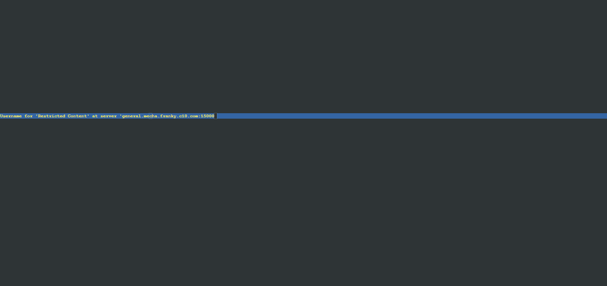
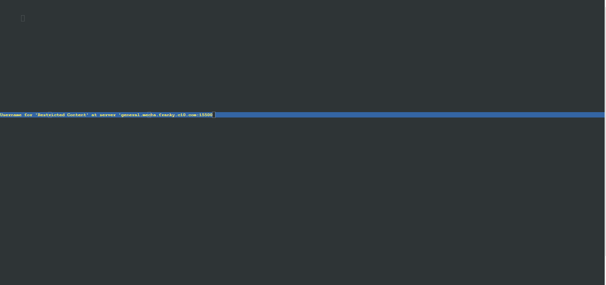
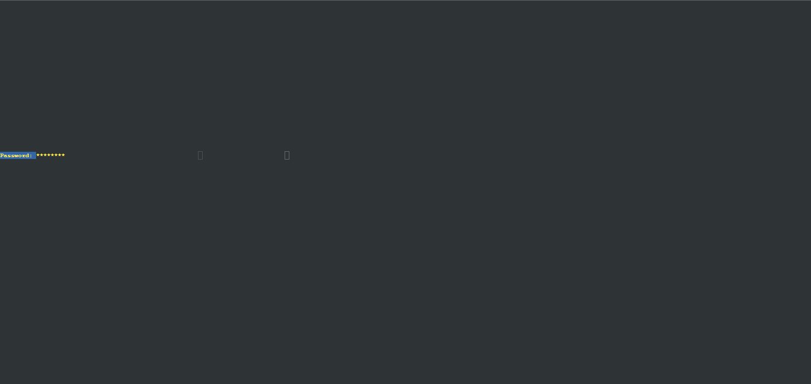
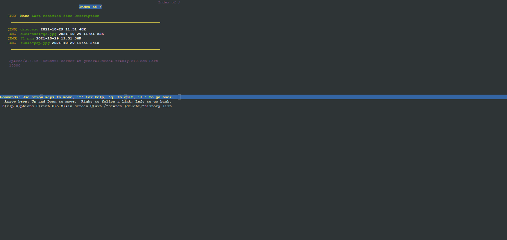
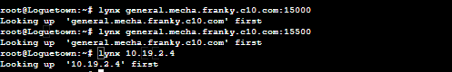
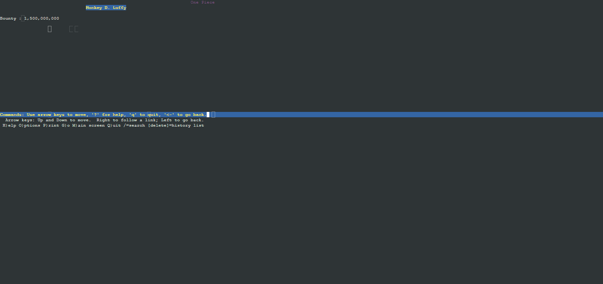
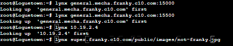
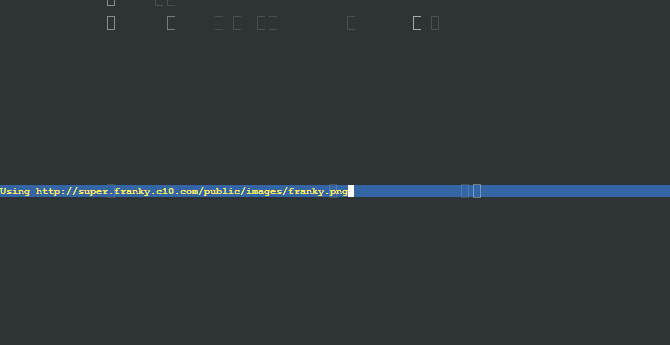
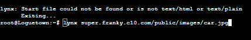
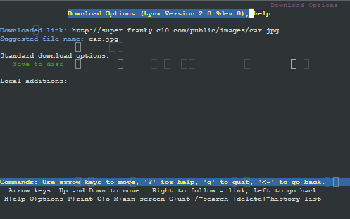

# Jarkom-Modul-2-C10-2021

## Anggota Kelompok C10
| Nama | NRP |
| ------------- | ------------- |
| Christian Bennett Robin | 05111940000078  |
| Erza Janitradevi Nadine  | 05111940000153  |
| Akmal Zaki Asmara  | 05111940000154  |

## Soal dan Pembahasan
### No 1
### No 2
### No 3
### No 4
### No 5
### No 6
### No 7
### No 8
### No 9
### No 10
### No 11
### No 12
### No 13
### No 14
Soal:  
Luffy meminta untuk web www.general.mecha.franky.yyy.com hanya bisa diakses dengan port 15000 dan port 15500
  
Jawab:  
Buat situs baru dengan nama general.mecha.franky.c10.com di Skypie dengan mengcopy template 0000-default.conf yang ada di /etc/apache2/sites-available dengan
```
cd /etc/apache2/sites-available/
cp 0000.default.conf general.mecha.franky.c10.com.conf
```
Masuk kedalam config filenya, lalu setting port menjadi 15000 dan 15500, dan sesuaikan servername, document root, dan server alias

```
<VirtualHost *:15000 *:15500>
ServerName general.mecha.franky.c10.com
ServerAdmin webmaster@localhost
DocumentRoot /var/www/general.mecha.franky.c10.com
ServerAlias www.general.mecha.franky.c10.com

...
```
Selanjutnya setting port untuk listen ke port 15000 dan 15500 di /etc/apache2/ports.conf
```
...
Listen 15000
Listen 15500
...
```
Lakukan restart pada apache
```
service apache2 restart
```
Buat document rootnya dengan membuat direktori di /var/www
```
mkdir /var/www/general.mecha.franky.c10.com
```
Download zip general.mecha.franky.c10.com.zip dari github yang ditentukan, dan isi document root dengan isi zip yang telah didownload
```
wget https://raw.githubusercontent.com/FeinardSlim/Praktikum-Modul-2-Jarkom/main/general.mecha.franky.zip

unzip general.mecha.franky.zip
cp -R general.mecha.franky/* /var/www/general.mecha.franky.c10.com
```

Tes menggunakan lynx di LogueTown
```
lynx general.mecha.franky.c10.com:15000
lynx general.mecha.franky.c10.com:15500
```

### No 15
Soal :  
Tambahkan autentikasi dengan username luffy dan password onepiece pada general.mecha.franky.yyy.com

Jawab :  
Kembali buka general.mecha.franky.c10.conf di /etc/apache2/sites-available. Masukkan konfigurasi autentikasi untuk situs tersebut
```
...
<Directory "/var/www/general.mecha.franky.c10.com">
    AuthType Basic
    AuthName "Restricted Content"
    AuthUserFile /etc/apache2/.htpasswd
    Require valid-user
</Directory>
...
```
Buat username dan password menggunakan htpasswd.
```
htpasswd -c /etc/apache2/.htpasswd luffy
```
Setelah itu, anda akan diminta password untuk akun luffy. Apabila htpasswd berhasil dibuat, lakukan restart pada apache.
```
service apache2 restart
```
Tes menggunakan lynx di LogueTown
```
lynx general.mecha.franky.c10.com:15000
lynx general.mecha.franky.c10.com:15500
```




### No 16
Soal :  
Setiap kali mengakses IP Skypie akan dialihkan secara otomatis ke www.franky.yyy.com

Jawab :  
Masuk ke dalam /var/www/html, dan buat file .htaccess disana. Setelah itu masukkan konfigurasi untuk redirect menggunakan RewriteEngine

```
RewriteEngine On
RewriteBase /
RewriteCond %{HTTP_HOST} ^10\.19\.2\.4$
RewriteRule ^(.*)$ http://www.franky.c10.com/$1 [L,R=301]
```

Lakukan restart pada apache
```
service apache2 restart
```

RewriteCond akan melakukan filter pada request dengan IP 10.19.2.4 (IP Skypie), setelah itu RewriteRule akan menerima segala request dengan IP Skypie dengan folder atau path apapun dan akan segera melakukan redirect 301 ke www.franky.c10.com




### No 17
Soal :  
Mengarahkan request gambar yang memiliki substring 'franky' di super.franky.yyy.com ke franky.png

Jawab :  
Masuk ke dalam /var/www/super.franky.c10.com, dan buat file .htaccess disana. Setelah itu masukkan konfigurasi untuk redirect menggunakan RewriteEngine

```
RewriteEngine On
RewriteRule (.*)franky(.*)(\.jpg|\.png|\.gif)$ http://super.franky.c10.com/public/images/franky.png [L,R=301]
```

Lakukan restart pada apache
```
service apache2 restart
```

RewriteRule akan melakukan redirect 301 dari request dengan regex yang telah ditentukan yaitu path yang memiliki substring franky dan request merupakan request gambar ke file franky.png

Test menggunakan file dengan substring franky : 




Test menggunakan file tanpa substring franky :



